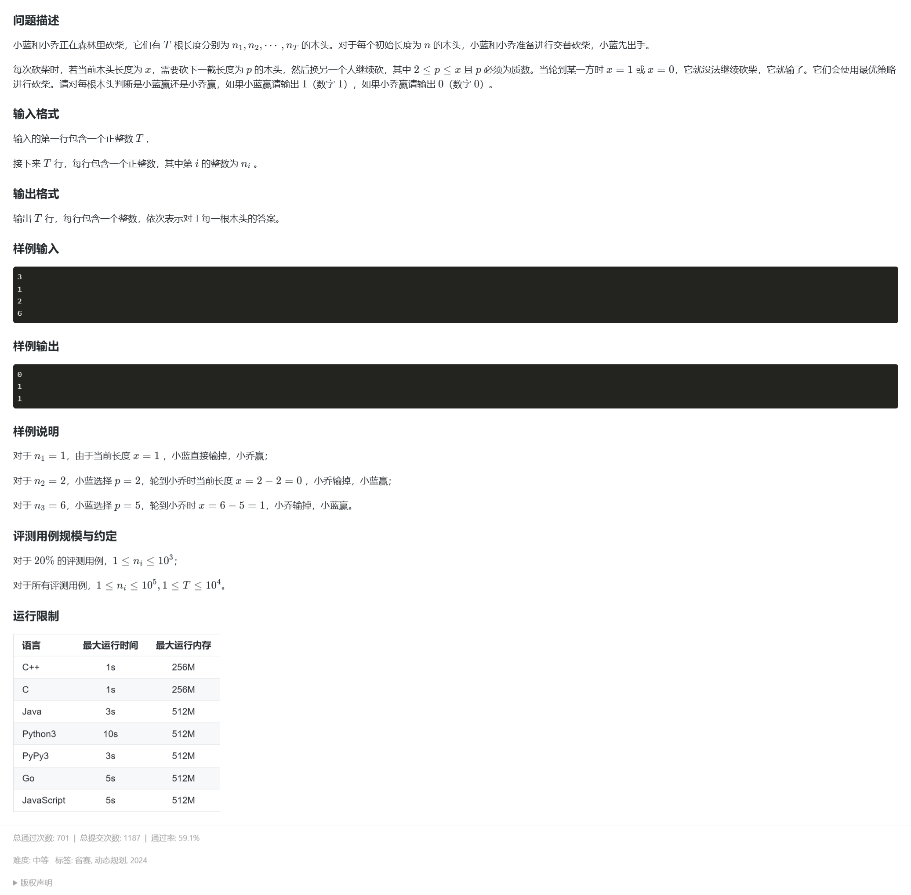

题目链接  
https://www.lanqiao.cn/problems/19722/learning/

讲解视频  
【蓝桥杯真题 - 砍柴】https://www.bilibili.com/video/BV1CwR4YZECk?vd_source=da1caf3b7f437354168d550ca75fe126

这个视频里面已经说的很清楚了，也没什么想多说的，谈谈自己的理解吧。问题的关键是判断这次是必胜态还是必败态，如果下一次对方（即后继状态）有一个必败态，则你的这次一定是必胜态，如果后继状态全为必胜态，则这次一定为必败态。有点像你抓住了别人的把柄，一定要把对方逼入绝路，而如果对方实在过于完美，你抓不到，最终只能自食其果，二者选其一，你必输。

### AC代码

```
#include <bits/stdc++.h>
using namespace std;
typedef long long LL;
const LL MAX = 1e5 + 100;

int primes[MAX], cnt, ans[MAX], tmp, n;
bool vis[MAX];

//找出范围内的所有质数
void init(int n) {
	for (int i = 2; i <= n; ++i) {
		if (!vis[i]) {
			primes[cnt++] = i;
		}
		for (int j = 0; j < cnt; ++j) {
			if (i * primes[j] > n) break;
			vis[i * primes[j]] = true;
			if (i % primes[j] == 0) break;
		}
	}
}

int main() {
#ifdef JiuQi
	freopen("test.txt", "r", stdin);
#endif
	ios::sync_with_stdio(false);
    cin.tie(0), cout.tie(0);
	
	init(MAX - 1);
	for (int i = 2; i < MAX; ++i) {  //把数据范围内的所有数据都先标记好是必胜态还是必败态
                                    //按从小到大的顺序标，因为后续状态要用到前面的状态来判断
		for (int j = 0; primes[j] <= i && j < cnt; ++j) {  //列举在范围内（本人是觉得 j < cnt 没太大必要）的质数，减之后的数一定能找到其状态
			if (ans[i - primes[j]] == 0) {
				ans[i] = 1;
				break; //只要在其后继状态中找到一个必败态，则当前一定为必胜态，标记为 1
			}
		}
	}
	
	cin >> n;
	while (n--) {
		cin >> tmp;
		cout << ans[tmp] << endl;  //由于之前已经把在数据范围内的数全部标记好了状态，所以，直接输出即可
	}
	
    return 0; 
}
```
