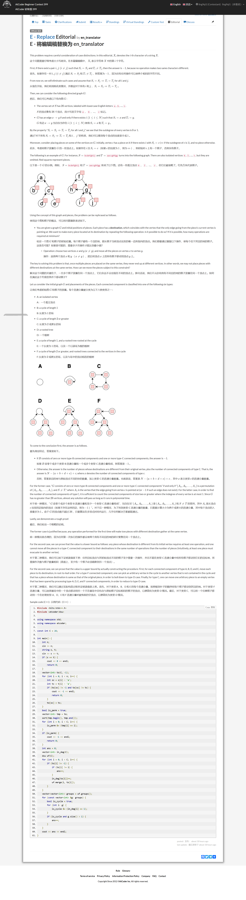
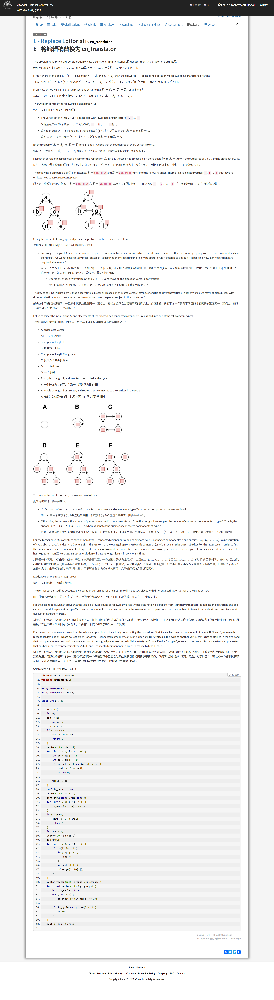

## 第一次的想法

```
#include <iostream>
#include <algorithm>
#include <set>
#include <vector>
#include <map>
#define PII pair<int, int>
using namespace std;

map<char, bool> mp_1;
map<char, char> mp_2;
map<char, bool> vis;
int n, cnt;
string s1, s2;

int main() {
#ifdef JiuQi
    freopen("test.txt", "r", stdin);
#endif // JiuQi
  ios::sync_with_stdio(false);
  cin.tie(nullptr);

    cin >> n >> s1 >> s2;
    for (int i = 0; i < n; ++i) {
        if (mp_2.find(s1[i]) != mp_2.end()) {
            if (mp_2[s1[i]] != s2[i]) {
                cout << -1 << endl;
                return 0;
            }
        }
        else {
            mp_2[s1[i]] = s2[i];
            mp_1[s1[i]] = true;
        }
    }

    for (int i = 0; i < n; ++i) {
        if (mp_1[s1[i]]) {
            if (s1[i] != s2[i]) {
                char ch = s2[i];
                cnt++;
                mp_1[s1[i]] = false;
                vis[s1[i]] = true;
                vis[ch] = true;
                while (ch != mp_2[ch] || mp_2[ch] == true) {
                    if (vis.find(vis[mp_2[ch]]) != vis.end()) {
                        cnt++;
                        vis[mp_2[ch]] = true;
                        mp_1[ch] = false;
                        break;
                    }
                    if (mp_2.find(ch) == mp_2.end()) break;
                    if (ch == mp_2[ch]) {
                        mp_1[ch] = false;
                        break;
                    }
                    if (mp_2[ch] == true) {
                        mp_1[ch] = false;
                        ch = mp_2[ch];
                        cnt++;
                    }
                }
                vis.clear();
            }
            else {
                mp_1[s1[i]] = false;
            }
        }
    }
    cout << cnt << endl;
    return 0;
}
```

## 看了答案后的启发（~~虽然没看太懂~~），转成图
最后答案也是超时了很多
```
#include <algorithm>
#include <iostream>
#include <set>
#include <utility>
#include <vector>
#include <queue>
#include <map>
using namespace std;
const int MAX = 2e5 + 100;

int n, din[MAX], G[MAX], cnt;
string s, t;
queue<int> que;
map<int, int> mp;
map<int, bool> vis;

void topoSort() {
	for (int i = 0; i < 26; ++i) {
		if (din[i] == 0 && vis[i] == true) {
			que.push(i);
			vis[i] = false;
		}
	}
	
	while (!que.empty()) {
		int u = que.front();
		que.pop();
		
		if (mp.find(u) == mp.end()) continue;
		int v = G[u];
		din[v]--;
		cnt++;
		if (din[v] == 0) {
			vis[v] = false;
			que.push(v);
		}
	}
}

int main() {
#ifdef JiuQi
    freopen("test_1.txt", "r", stdin);
#endif // JiuQi
	ios::sync_with_stdio(false);
	cin.tie(nullptr);
  
	cin >> n >> s >> t;

	for (int i = 0 ; i < n; ++i) {
		if ((mp.find(s[i] - 'a') != mp.end()) && mp[s[i] - 'a'] != t[i] - 'a') {
			cout << -1 << endl;
			return 0;
		}
		mp[s[i] - 'a'] = t[i] - 'a';
		if (s[i] != t[i]) {
			G[s[i] - 'a'] = t[i] - 'a';
			din[t[i] - 'a'] = 1;
			vis[s[i] - 'a'] = true;
			vis[t[i] - 'a'] = true;
		}
	}
	topoSort();

	while (1) {
		bool flag = false;
		for (int i = 0; i < 26; ++i) {
			if (din[i] != 0) {
				din[i]--;
				cnt += 2;
				for (auto it = mp.begin(); it != mp.end(); ++it) {
					if (it->second == i) {
						mp.erase(it);
						break;
					}
				}
				topoSort();
				flag = true;
				break;
			}
		}
		if (!flag) {
			cout << cnt << endl;
			return 0;
		}
	}

	return 0;
}
```

## 官方答案



