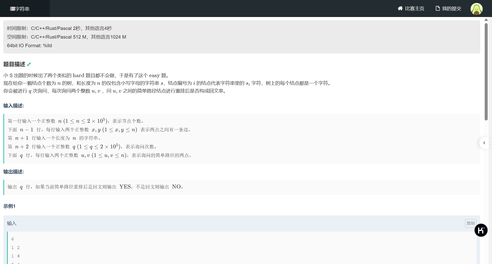
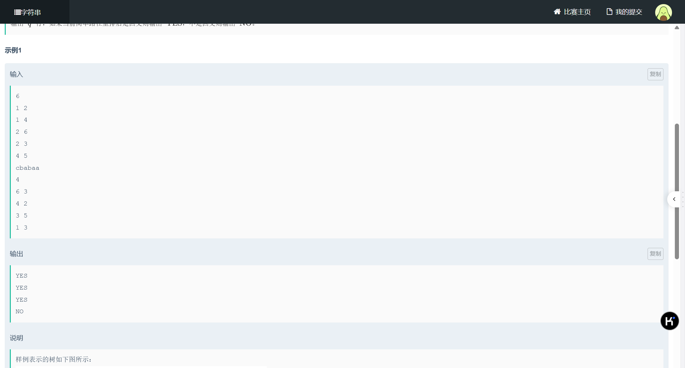
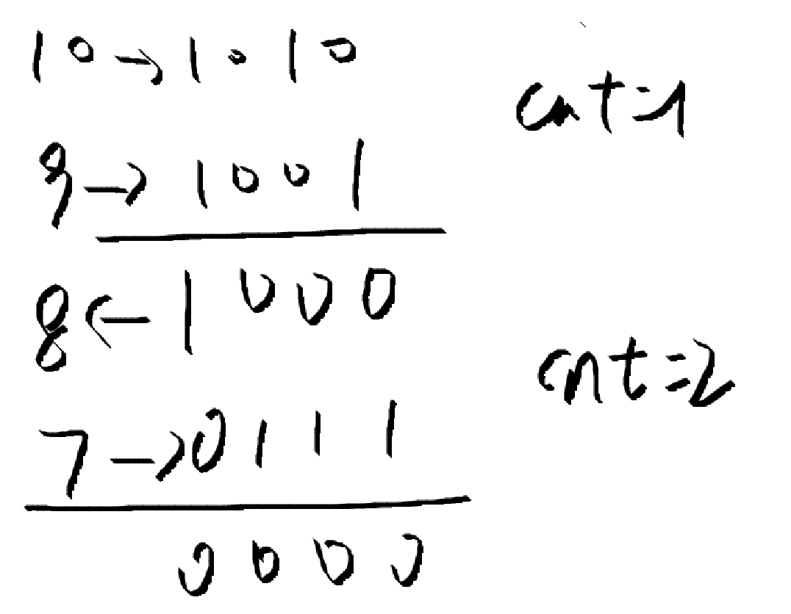

### [题目链接](https://ac.nowcoder.com/acm/contest/103786/F)


做这道题需要一个前置知识 ：[位运算](https://oi-wiki.org/math/bit/#%E4%B8%8E%E6%88%96%E5%BC%82%E6%88%96)


对于其中的异或运算的理解是解这道题的关键，看完这道题后，我们不难发现，有两大难点：  

- 寻找两点之间的最近公共祖先，在找的过程中顺便把路径中的数都给一一储存下来（ `f[u][0]` )，好进行后续的用数字对应字符，然后对其进行是否是回文串的判断。  
- 快速判断是否是回文串，第一反应，用 `map` 记录每个字符出现的次数，我们只允许奇数出现一次，在中间的时候。其余位置都必须有配对，即只能出现偶数次。  

大致思路是这样，但我们会发现，时间复杂度早超了，每次都要全部遍历字符串，记录出现的次数，是 $O(n^2)$ 级别的时间复杂度。  
问题就出现在对其是否能组成回文串的判断，有没有什么办法能快速判断呢？  
这就要回到我们最开始所说的，对于异或的理解和应用了。异或，这是个可逆的运算，意思也就是说 `a ^ b ^ b = a` ，他有抵消的功能，你想到了什么？对啊，出现偶数次不就相当于抵消了吗？下面是我觉得这道题解的最妙的部分，一共有 26 个字母，`a -> 1（1）`， `b -> 2（10）`， `c -> 4（100）`， `d -> 8（1000）`，啧啧啧，太妙了，它充分利用了异或相互抵消，但不同位的 1 和 0 不相互打扰的特性（只要不进位）。所以，最后只要数出 1 的个数即可。  

- 对了，还有一个快速数二进制中 1 的个数的很巧的办法，其原理就是 `n & (n - 1)` 会消除掉二进制中最末的一位 1 。  
```
int count_ones(int n) {
    int cnt = 0;
    while (n) {
        n &= (n - 1);
        cnt++;
    }
    return cnt;
} 
```

举个例子


看一下别人的题解吧，我觉得讲的比我的清楚


## AC代码

```
#include <bits/stdc++.h>
using namespace std;
const int MAX = 4e5 + 100;
typedef long long LL;

LL n, q, dep[MAX], f[MAX][20], s[MAX];
vector<LL> G[MAX];
string str;

void dfs(LL u, LL par) {
    dep[u] = dep[par] + 1;
    f[u][0] = par;
    for (int i = 1; i <= 19; ++i) {
        f[u][i] = f[f[u][i - 1]][i - 1];
    }
    for (LL v : G[u]) {
        if (v == par) continue;
        s[v] = (1 << (str[v - 1] - 'a')) ^ s[u];  //看完之后关于树上前缀和的相关变体之后，你会发现，变化的部分有限，基本就两三处，这就是其中一处
        dfs(v, u);
    }
}

LL LCA(LL u, LL v) {
    if (dep[u] < dep[v]) swap(u, v);
    for (int i = 19; i >= 0; --i) {
        if (dep[f[u][i]] >= dep[v]) {
            u = f[u][i];
        }
    }
    if (u == v) return v;
    for (int i = 19; i >= 0; --i) {
        if (f[u][i] != f[v][i]) {
            u = f[u][i];
            v = f[v][i];
        }
    }
    return f[u][0];
}

//根到 a 异或 根到 b 异或 LCA(a, b)，则可以把根到最近公共祖先的数都异或掉
//即都消除掉，因为异或两次相当于加上再减去，没做变化，则剩余的是 a 到 b 简单路径上的异或值
LL find_ones(LL a, LL b) {
    return s[a] ^ s[b] ^ (1 << (str[LCA(a, b) - 1] - 'a')); 
}

//数异或后的数 1 的个数，即字母出现奇数的次数
bool Judge(LL a, LL b) {
	LL temp = find_ones(a, b);
	LL cnt = 0;
	while (temp) {
		temp &= (temp - 1);
		cnt++;
	}
	return cnt <= 1;
}

int main() {
    ios::sync_with_stdio(false);
    cin.tie(0), cout.tie(0);
    
    cin >> n;
    for (LL i = 1; i < n; ++i) {
        LL a, b;
        cin >> a >> b;
        G[a].push_back(b);
        G[b].push_back(a);
    }
    
    cin >> str;
    
    s[1] = 1 << (str[0] - 'a'); 
    dfs(1, 0);
    
    cin >> q;
    while (q--) {
        LL a, b;
        cin >> a >> b;
        cout << (Judge(a, b) ? "YES" : "NO") << endl;
    }
    
    return 0;
}

```

---


# 树上前缀和

[讲解视频](https://www.bilibili.com/video/BV1j14y1o7Rn?vd_source=da1caf3b7f437354168d550ca75fe126)

- 求路径中的点之和

```
#include <bits/stdc++.h>
using namespace std;
typedef long long LL;
const LL MAX = 1e6 + 100;

int n, q, dep[MAX], f[110][110], a, b, tmp, ans, dis[MAX]; 
vector<int> G[MAX];

void dfs(int u, int par) {
	dep[u] = dep[par] + 1;
	f[u][0] = par;
	for (int i = 1; i < 19; ++i) {
		f[u][i] = f[f[u][i - 1]][i - 1];
		if (f[u][i] == 0) break;
	}
	for (int v : G[u]) {
		if (v == par) continue;
		dis[v] = dis[u] + v;
		dfs(v, u);
	}
}

int LCA(int u, int v) {
	if (dep[u] < dep[v]) swap(u, v);
	for (int i = 19; i >= 0; --i) {
		if (dep[f[u][i]] >= dep[v]) {
			u = f[u][i];
		}
	}
	if (u == v) return v;
	for (int i = 19; i >= 0; --i) {
		if (f[u][i] != f[v][i]) {
			u = f[u][i];
			v = f[v][i];
		}
	}
	return f[u][0];
}

int main() {
#ifdef JiuQi
	freopen("test_1.txt", "r", stdin);
#endif
	ios::sync_with_stdio(false);
    cin.tie(0), cout.tie(0);
	
	dis[1] = 1;

	cin >> n;
	for (int i = 1; i < n; ++i) {
		cin >> a >> b;
		G[a].push_back(b);
		G[b].push_back(a);
	}
	dfs(1, 0);

	cin >> q;

	for (int i = 0; i < q; ++i) {
		cin >> a >> b;
		tmp = LCA(a, b);
		ans = dis[a] + dis[b] - dis[tmp] - dis[f[tmp][0]];  
		cout << ans << endl;
	}
    return 0; 
}
```

- 求路径中的边权之和

```
#include <bits/stdc++.h>
using namespace std;
typedef long long LL;
const LL MAX = 1e6 + 100;

struct Node {
	int v, w;
	Node() {}
	Node(int v, int w) : v(v), w(w) {}
};

int ans, n, q, dep[MAX], f[5500][22], dis[MAX], a, b, c;
vector<Node> G[MAX];

void dfs(int u, int par) {
	dep[u] = dep[par] + 1;
	f[u][0] = par;
	for (int i = 1; i <= 20; ++i) {
		f[u][i] = f[f[u][i - 1]][i - 1];
	}
	for (Node t : G[u]) {
		if (t.v == par) continue;
		dis[t.v] = dis[u] + t.w;
		dfs(t.v, u);
	}
}

int LCA(int u, int v) {
	if (dep[u] < dep[v]) swap(u, v);
	for (int i = 20; i >= 0; --i) {
		if (dep[f[u][i]] >= dep[v]) {
			u = f[u][i];
		}
	}
	if (u == v) return v;
	for (int i = 20; i >= 0; --i) {
		if (f[u][i] != f[v][i]) {
			u = f[u][i];
			v = f[v][i];
		}
	}
	return f[u][0];
}

int main() {
#ifdef JiuQi
	freopen("test.txt", "r", stdin);
#endif
	ios::sync_with_stdio(false);
    cin.tie(0), cout.tie(0);
	
	cin >> n;
	for (int i = 1; i < n; ++i) {
		cin >> a >> b >> c;
		G[a].push_back(Node(b, c));
		G[b].push_back(Node(a, c));
	}
	dfs(1, 0);
	cin >> q;
	for (int i = 0; i < q; ++i) {
		cin >> a >> b;
		cout << a << " " << b << endl;
		ans = dis[a] + dis[b] - 2 * dis[LCA(a, b)];
		cout << ans << endl;
	}
	
	
    return 0; 
}
```