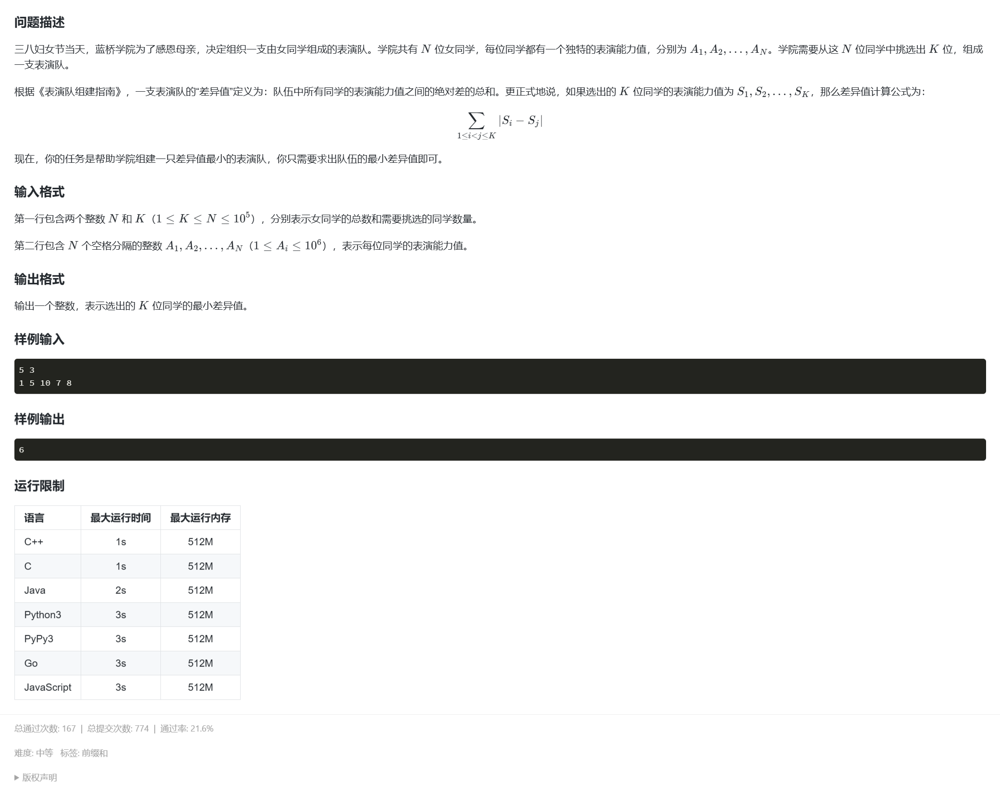

### 题目链接
https://www.lanqiao.cn/problems/20267/learning/?contest_id=249

### 讲解视频
【第 27 场 蓝桥入门赛 - 表演队】https://www.bilibili.com/video/BV1ZyRaYeEoj?vd_source=da1caf3b7f437354168d550ca75fe126

## 思路

思路很简单，就是找其中 k 个数之间的互相的差值和最小，下意识反应肯定是相邻的最好，最后的结果一定是相邻的几个数，证明嘛，可以用反证法，假如其中相对于最小的那个数（A）有一个数（B）比他更大，但没在最终结果里，那其余的数减 A 的值的和一定比其余的数减 B 的和更大，不符合要求。严格的证明嘛，懒得，自己证。  
因为这不是我想讲的重点，真正的难点是，当你排完序后，从 1 到 (n - k + 1) 分别往后延 （k - 1） 长度的数，每次这个所选出来的 k 个数中，快速得出互相差值的和的最小值。说实话，很难想出小于 $O(n^2)$ 的一个解法，不过，你可以试试。

## AC代码

```
#include <bits/stdc++.h>
using namespace std;
typedef long long LL;
const LL MAX = 1e6 + 100;

LL n, k, a[MAX], sum[MAX], pre[MAX], minn, temp;

int main() {
#ifdef JiuQi
	freopen("test.txt", "r", stdin);
#endif
	ios::sync_with_stdio(false);
    cin.tie(0), cout.tie(0);
	
	cin >> n >> k;
	for (int i = 1; i <= n; ++i) {
		cin >> a[i];
	}
	sort(a + 1, a + 1 + n);
	for (int i = 1; i <= n; ++i) {
		sum[i] = sum[i - 1] + a[i];
	}
    //先得出 [1, k] 区间中的数互相之间差的和
	for (int i = 1; i <= k; ++i) {
		pre[i] = pre[i - 1] + (i - 1) * a[i] - sum[i - 1];
	}
	
	minn = pre[k];
	temp = pre[k];
    //获取最开始的区间的和之后，依次往后延，假设每次前一次区间是 [a[i], a[i + k - 1]]，
    // 当前区间为 [a[i + 1], a[i + k]]， 则每次进行的操作为减去 a[i] 的贡献，加上 a[i + k] 的贡献。
	for (int i = 1; i + k <= n; ++i) {
		temp -= sum[i + k - 1] - sum[i] - (k - 1) * a[i];
		temp += (k - 1) * a[i + k] - sum[i + k - 1] + sum[i];
		minn = min(minn, temp); //更新到新区间后取最小值
	}
	cout << minn << endl;
    return 0; 
}
```