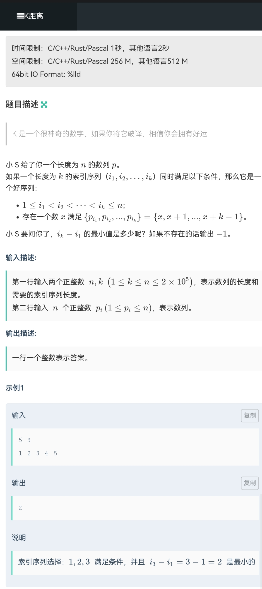
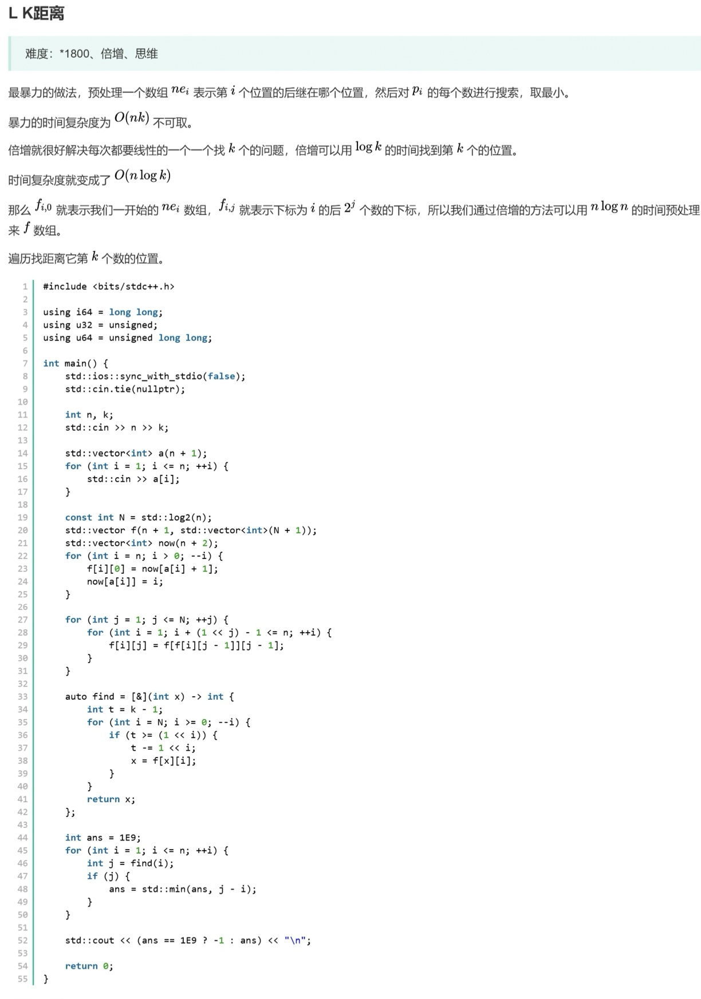

## 题解




## deepseek 

为了高效解决该问题，我们可以利用倍增思想预处理跳跃表，快速判断每个位置能否形成连续递增序列，并计算最小跨度。

### 方法思路
1. **预处理next数组**：记录每个位置的下一个数值+1的位置。
2. **构建跳跃表**：预处理每个位置的倍增跳跃信息，支持快速跳跃k-1步。
3. **遍历所有起点**：对于每个起点，尝试跳跃k-1步，若成功则计算跨度，维护最小值。

### 解决代码
```cpp
#include <bits/stdc++.h>
using namespace std;
const int INF = 0x3f3f3f3f;

int main() {
    ios::sync_with_stdio(false);
    cin.tie(nullptr);
    
    int n, k;
    cin >> n >> k;
    vector<int> p(n);
    for (auto &x : p) cin >> x;
    
    if (k == 1) {
        cout << "0\n";
        return 0;
    }
    
    vector<int> next(n, -1);
    unordered_map<int, int> last;
    for (int i = n - 1; i >= 0; --i) {
        int x = p[i];
        if (last.count(x + 1)) {
            next[i] = last[x + 1];
        } else {
            next[i] = -1;
        }
        last[x] = i;
    }
    
    const int LOG = 20;
    vector<vector<int>> jump(LOG, vector<int>(n, -1));
    for (int i = 0; i < n; ++i) jump[0][i] = next[i];
    for (int j = 1; j < LOG; ++j) {
        for (int i = 0; i < n; ++i) {
            if (jump[j-1][i] != -1) {
                jump[j][i] = jump[j-1][jump[j-1][i]];
            }
        }
    }
    
    int ans = INF;
    for (int i = 0; i < n; ++i) {
        int current = i;
        int rem = k - 1;
        for (int j = 0; j < LOG; ++j) {
            if (rem & (1 << j)) {
                if (current == -1) break;
                current = jump[j][current];
                if (current == -1) break;
                rem ^= (1 << j); // 确保已经处理该位
            }
        }
        if (current != -1 && rem == 0) {
            ans = min(ans, current - i);
        }
    }
    
    cout << (ans == INF ? -1 : ans) << "\n";
    return 0;
}
```

### 代码解释
1. **预处理next数组**：从右到左遍历数组，记录每个数值的下一个位置。
2. **构建跳跃表**：利用倍增思想，预处理每个位置跳跃2^j步后的位置。
3. **遍历所有起点**：对于每个起点，尝试跳跃k-1步，若成功则计算跨度并更新最小值。
4. **边界处理**：当k=1时直接返回0，其他情况按正常流程处理。

该方法通过预处理和倍增跳跃，将时间复杂度优化至O(n log k)，适用于大规模数据。


