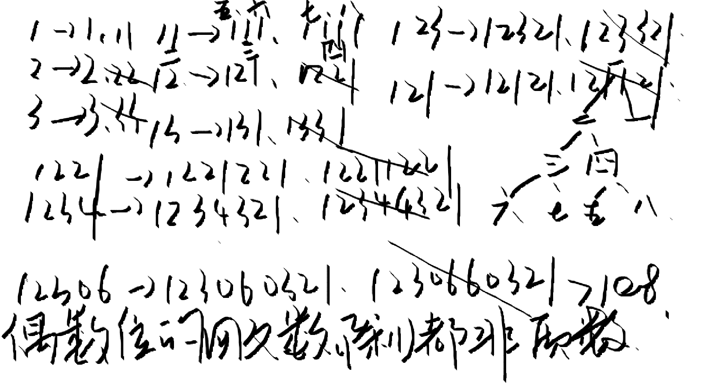
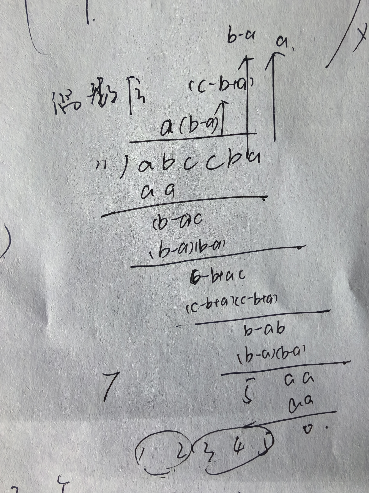

# [USACO1.5] 回文质数 Prime Palindromes

## 题目描述

因为 $151$ 既是一个质数又是一个回文数（从左到右和从右到左是看一样的），所以 $151$ 是回文质数。

写一个程序来找出范围 $[a,b] (5 \le a < b \le 100,000,000)$（一亿）间的所有回文质数。

## 输入格式

第一行输入两个正整数 $a$ 和 $b$。

## 输出格式

输出一个回文质数的列表，一行一个。

## 样例 #1

### 样例输入 #1

```
5 500
```

### 样例输出 #1

```
5
7
11
101
131
151
181
191
313
353
373
383
```

## 提示

Hint 1: Generate the palindromes and see if they are prime.

提示 1: 找出所有的回文数再判断它们是不是质数（素数）.


Hint 2: Generate palindromes by combining digits properly. You might need more than one of the loops like below.

提示 2: 要产生正确的回文数，你可能需要几个像下面这样的循环。


题目翻译来自NOCOW。

USACO Training Section 1.5


产生长度为 $5$ 的回文数：

```cpp
for (d1 = 1; d1 <= 9; d1+=2) {    // 只有奇数才会是素数
     for (d2 = 0; d2 <= 9; d2++) {
         for (d3 = 0; d3 <= 9; d3++) {
           palindrome = 10000*d1 + 1000*d2 +100*d3 + 10*d2 + d1;//(处理回文数...)
         }
     }
 }

```
### 做题思路：
- 因为回文数的数量 $(lnn)$ 少于素数的数量 $(\frac{n}{lnn})$，所以先找出 $1e8$ 以内的回文数




- 又因为回文数中，偶数为的回文数，除 $11$ 以外，皆不是素数，随便写个 $\frac{abccba}{11}$ 搞搞，最后肯定没余数，俺懒，自己证，算了，还是手写一个吧。



