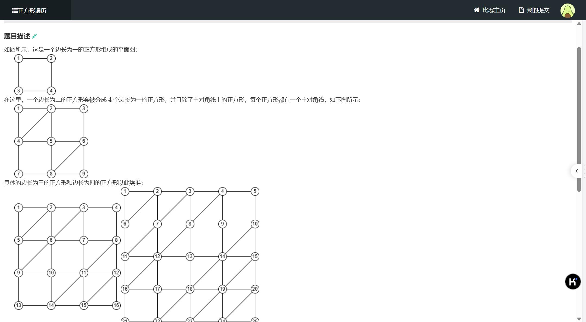
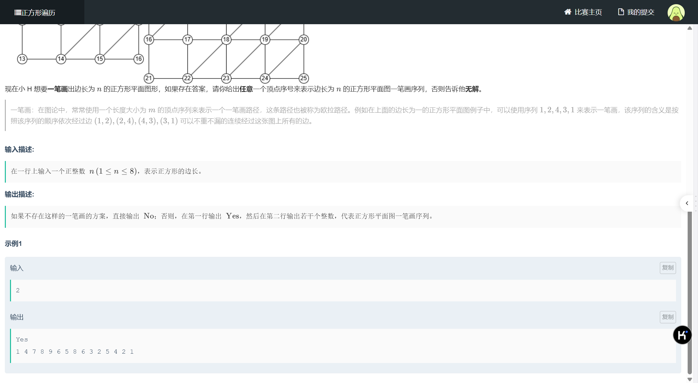
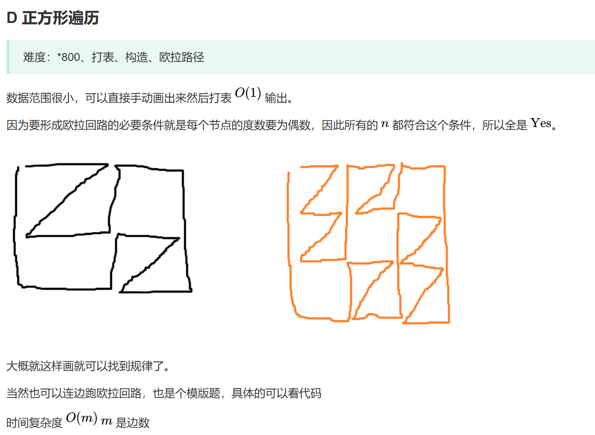

题目链接  
https://ac.nowcoder.com/acm/contest/103786/D

### 思路

没啥思路，就是暴力，毕竟 n 最多也就到 8 ，这时候不暴力，啥时候暴啊。  
记录下这道题没啥意思，就是第一次写代码超过了一百行之后还能过的，让我高兴了半小时，值得记录一下。  
当我看题解的时候，差点没气死，呵呵，欧拉回路，模版题，不是，要是没做过怎么办，你他妈放在第四道，总共有十三道诶，后面不做啦？  
其实思路也挺简单，就是建这个图着实花了点心思，找规律啊找规律。

### AC代码

```
#include <bits/stdc++.h>
using namespace std;
typedef long long LL;
const LL MAX = 1e6 + 100;
const LL MOD = 1e9 + 7;

struct Node {
	LL u, v;
	Node() {}
	Node(LL u, LL v) : u(u), v(v) {}
};

bool operator<(const Node &a, const Node &b) {
	return a.u == b.u ? a.v < b.v : a.u < b.u;
}

LL n, sum, tot, cnt;
LL g[100][100];
vector<LL> G[MAX], d;
map<Node, bool> mp;

int dx[] = {-1, -1, 0, 1, 1, 0};
int dy[] = {0, 1, 1, 0, -1, -1};

void output() {
	for (int i = 0; i < d.size(); ++i) {
		cout << d[i] << " ";
	}
}

void dfs(int u, int f, int cnt) {
	if (u == 1 && cnt != 0) {
		if (cnt == sum) {
			cout << "Yes" << endl;
			output();
			exit(0);
		}
		return ;
	}
	for (LL v : G[u]) {
		if (mp[Node(v, u)] && mp[Node(u, v)]) {
			mp[Node(v, u)] = false;
			mp[Node(u, v)] = false;
			d.push_back(v);
			dfs(v, u, cnt + 1);
			mp[Node(v, u)] = true;
			mp[Node(u, v)] = true;
			d.pop_back();
		}
	}
}

int main() {
#ifdef JiuQi
	freopen("test.txt", "r", stdin);
#endif
	ios::sync_with_stdio(false);
    cin.tie(0), cout.tie(0);
	
	cin >> n;
	sum = n * (3 * n + 1);
	n++;
	for (int i = 1; i <= n; ++i) {
		for (int j = 1; j <= n; ++j) {
			g[i][j] = ++tot;
		}
	}
	
	for (int i = 1; i <= n; ++i) {
		for (int j = 1; j <= n; ++j) {
			if ((i + j) != (n + 1)) {
				for (int c = 0; c < 6; ++c) {
					int x = i + dx[c];
					int y = j + dy[c];
					if (x < 1 || x > n || y < 1 || y > n) continue;
					G[g[i][j]].push_back(g[x][y]);
					G[g[x][y]].push_back(g[i][j]);
					mp[Node(g[i][j], g[x][y])] = true;
					mp[Node(g[x][y], g[i][j])] = true;
				}
			}
			else {
				if (g[i - 1][j] != 0) {
					G[g[i][j]].push_back(g[i - 1][j]);
					G[g[i - 1][j]].push_back(g[i][j]);
					mp[Node(g[i][j], g[i - 1][j])] = true;
					mp[Node(g[i - 1][j], g[i][j])] = true;
				}
				if (g[i + 1][j] != 0) {
					G[g[i][j]].push_back(g[i + 1][j]);
					G[g[i + 1][j]].push_back(g[i][j]);
					mp[Node(g[i][j], g[i + 1][j])] = true;
					mp[Node(g[i + 1][j], g[i][j])] = true;
				}
				if (g[i][j - 1] != 0) {
					G[g[i][j]].push_back(g[i][j - 1]);
					G[g[i][j - 1]].push_back(g[i][j]);
					mp[Node(g[i][j], g[i][j - 1])] = true;
					mp[Node(g[i][j - 1], g[i][j])] = true;
				}
				if (g[i][j + 1] != 0) {
					G[g[i][j]].push_back(g[i][j + 1]);
					G[g[i][j + 1]].push_back(g[i][j]);
					mp[Node(g[i][j], g[i][j + 1])] = true;
					mp[Node(g[i][j + 1], g[i][j])] = true;
				}
			}
		}
	}
	d.push_back(1);
	dfs(1, 0, 0);
	printf("No\n");
    return 0; 
}
```
### 题解思路




### 题解代码

```
#include <bits/stdc++.h>

using i64 = long long;
using u64 = unsigned long long;
using u32 = unsigned int;
using u128 = unsigned __int128;

constexpr int N = 100010;

int main() {
	std::ios::sync_with_stdio(false);
	std::cin.tie(nullptr);
	
	int n;
	std::cin >> n;
	
	std::vector<std::vector<std::pair<int, int>>> e(N);
	std::vector<bool> vis(N);
	n++;
	int idx = 0;
	std::vector<bool> no(N);
	no[n] = true;
	for (int i = 1; i <= n - 1; i++) {
		no[n + (n - 1) * i] = true;
	}
	
	auto add = [&](int u, int v) -> void {
		e[u].push_back({v, idx});
		e[v].push_back({u, idx++});
	};
	// 连横边
	for (int i = 0; i < n; i++) {
		for (int j = 1; j < n; j++) {
			add(n * i + j, n * i + j + 1);
		}
	}
	// 连竖边
	for (int i = 1; i <= n; i++) {
		for (int j = 0; j < n - 1; j++) {
			add(n * j + i, n * (j + 1) + i);
		}
	}
	// 连斜边
	for (int i = 0; i < n - 1; i++) {
		for (int j = 1; j <= n; j++) {
			int now = n * i + j;
			int nxt = now + n - 1;
			if (!no[now] && now != n * i + 1) {
				add(now, nxt);
			}
		}
	}
	std::vector<int> ans;
    // 欧拉回路
	auto dfs = [&](auto &&self, int u) -> void {
		for (auto [v, id]: e[u]) {
			if (vis[id]) {
				continue;
			}
			vis[id] = true;
			self(self, v);
		}
		ans.push_back(u);
	};
	dfs(dfs, 1);
	std::cout << "Yes\n";
	for (auto t : ans) {
		std::cout << t << " ";
	}
	
	return 0;
}
```