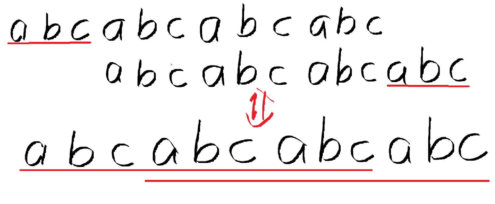
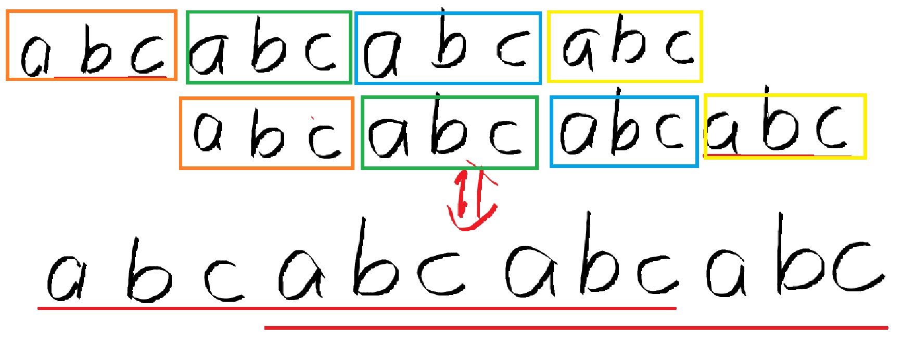

# [POI 2012] OKR-A Horrible Poem

## 题目

给出一个由小写英文字母组成的字符串 $S$，再给出 $q$ 个询问，要求回答 $S$ 某个子串的最短循环节。

如果字符串 $B$ 是字符串 $A$ 的循环节，那么 $A$ 可以由 $B$ 重复若干次得到。

--- 

第一行一个正整数 $n\ (n\le 5\times 10^5)$，表示 $S$ 的长度。

第二行 $n$ 个小写英文字母，表示字符串 $S$。

第三行一个正整数 $q\ (q\le 2\times 10^6)$，表示询问次数。

下面 $q$ 行每行两个正整数 $a,b(1\le a\le b\le n)$，表示询问字符串 $S[a\cdots b]$ 的最短循环节长度。


## 样例 #1

### 样例输入 #1

```
8
aaabcabc
3
1 3
3 8
4 8
```

### 样例输出 #1

```
1
3
5
```

### $small$ $tips$
- 寻找最小质因子（线性筛）
- 字符串哈希
- 寻找最长公共前后缀


1. 寻找最小质因子( `min_primes[]` )

```cpp
typedef long long LL;
const LL MAX = 5e5 + 10;
LL primes[MAX], min_primes[MAX];
bool composite[MAX];

void isPrime() {
    LL t = 0;
    foe (LL i = 2; i < MAX; ++i) {
        if (!composite[i]) {
            primes[t++] = i;
            min_primes[i] = i;
        }
        for (LL j = 0; j < t; ++j) {
            if (i * primes[j] > MAX) break;
            composite[i * primes[j]] = true;
            min_primes[i * primes[j]] = primes[j];
            if (i % primes[j] == 0) break;
        }
    }

}
```


2. 字符串哈希

```cpp
const LL P = 131;   //13331 / 13131 (质数)
typedef unsigned long long ULL;
string str;
ULL p[MAX], prefix[MAX];

void rolling_hash() {
    prefix[0] = 0;
    LL p[0] = 1;
    for (LL i = 1; i <= n; ++i) {
        p[i] = p[i - 1] * P;
        prefix[i] = prefix[i - 1] * P + str[i - 1];
    }
}

LL query(LL a, LL b) {
    return prefix[b] - prefix[a - 1] * p[b - a + 1];
}
```


3. 最长公共前后缀（不完全对）

$eg.$ 


- 要去寻找字符串的最短循环节，本质是找最短公共前后缀（不对），因为如果是寻找最长公共前后缀，中间可以不同，但最短循环节中间必须相同，且是前$/$后缀的 $K$ 倍。并且字符串哈希的本质是快速判断这两个字符串是否相同，若进行截取字符串相同长度的前后缀的操作的话，若这两个的哈希值相同，则这两个字符串一定相同，则该前后缀一定是其循环节。 $Why?$ 

## explainas


相同颜色方框框起来的字符串一定相同，所以，同排的，后一个方框跟前一个方框相同。


```
bool judge(LL a, LL b, LL len) {
    return query(a, b - len) == query(a + len, b);
}
```


4. 使用最小质因子
- 首先，你得想清楚为什么要寻找长度的质因子，比如 `len = 12`，他的循环节一定是 12 的约数或其整数倍，即 `1, 2, 3, 4, 6, 12` 。从这个例子可以看出， 1 和 12 本身需要单独讨论。
- 其实，你若是不找质因子也可以做题，但需要将长度一个个递增，会TLE，而且这道题还卡常，伤脑筋。

```cpp
LL len = b - a + 1;
LL cnt = 0;
LL factor[MAX];
if (judge(a, b, 1)) {
    cout << 1 << endl;
}
else {
    while (len != 1) {
        factor[++cnt] = min_primes[len]; // factor[1] = 3; factor[2] = 2 ， 一定是递减地储存进来，因为len在持续减小，额，倒也不一定，len减小不代表min_primes[len]减小，但大致是这个递减的方向。
        len /= min_primes[len]; // len = 4; 2(退出)， 这一步的目的是找到len 除了其最小质因子（我感觉也不是最小质因子啊，12对应的就是3，为什么不是2呢）另一个因数。
    }
    len = b - a + 1;
    for (LL i = 1; i <= cnt; ++i) {
        if (a, b, len / factor[i]) {
            len /= factor[i];
        }
    }
    cout << len << endl;
}
```


```cpp
//完整代码（别人的，俺懒得写了）
#include <cstring>
#include <cstdio>
using namespace std;
const int MAXN = 500010;
char str[MAXN];
int n;
unsigned long long Hash[MAXN];
const int base = 13131;
unsigned long long poww[MAXN];
int mod = 1e9+7;
int prime_table[MAXN];
bool not_prime[MAXN];
int min_prime_factor[MAXN];//min_prime_factor[i]表示i的最小质因子是多少
int factor[MAXN];
int factor_cnt;
int prime_cnt;
int read(){
    int x = 0,f = 1;
    static char c;
    c = getchar();
    while(c<'0'||c>'9'){ if(c=='-')f = -1;c= getchar();}
    while(c>='0'&&c<='9')x = x*10+c-'0',c = getchar();
    return x*f;
}
void prime(){
    for(int i = 2;i<=MAXN;i++){
        if(!not_prime[i]){
            prime_table[++prime_cnt] = i;
            min_prime_factor[i] = i;
        }
        for(int j = 1;j<=prime_cnt&&i*prime_table[j]<=MAXN;j++){
            not_prime[i*prime_table[j]] = true;
            min_prime_factor[i*prime_table[j]] = prime_table[j];
            if(!(i%prime_table[j]))break;
        }
    }
}
void calPow(){
    poww[0] = 1;
    for(int i = 1;i<=n;i++){
        poww[i] = poww[i-1]*base;
    }
}
void cal_hash(){
    for(int i = 1;i<=n;i++){
        Hash[i] = Hash[i-1]*base+str[i]-'a'+1;
    }
}
unsigned long long getHash(int l,int r){//返回以s开始，包括s的，长度为n的区间的哈希
    return Hash[r]-Hash[l-1]*poww[r-l+1];
}
bool judge(int l,int r,int len){
    return getHash(l,r-len)==getHash(l+len,r);
}
int main() {
    n = read();
    scanf("%s",str+1);
    prime();
    calPow();
    cal_hash();
    int q;
    q = read();
    int l,r;
    while(q--){
        l = read();
        r = read();
        int len = r-l+1;
        if(judge(l,r,1)){
            printf("%d\n",1);
        }else{
            factor_cnt = 0;
            while(len!=1){
                factor[++factor_cnt] = min_prime_factor[len];
                len = len / min_prime_factor[len];//可以保证factor里面因数是递减的，原因应该可以想明白
                //因为min_prime_factor[i]储存的是i的最小质因数，不断这样计算下去，facotr里面的数会越来越小。
            }
            len = r-l+1;
            for(int i = 1;i<=factor_cnt;i++){
                if(judge(l,r,len/factor[i])){
                    len /= factor[i];
                }
            }
            printf("%d\n",len);
        }
    }
    return 0;
}
```